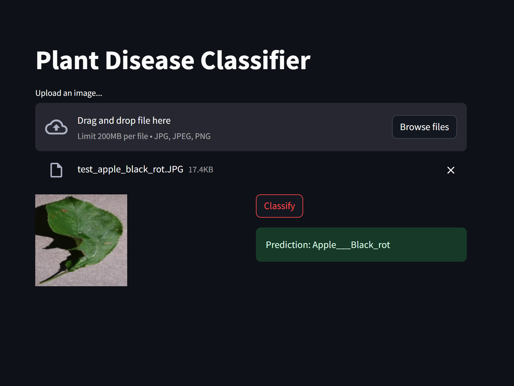

Developed a CNN model achieving 93.41% accuracy in plant disease prediction from leaf images, enhancing performance through data preprocessing and dropout regularization, and integrated Streamlit for user-friendly model visualization and diagnosis.

